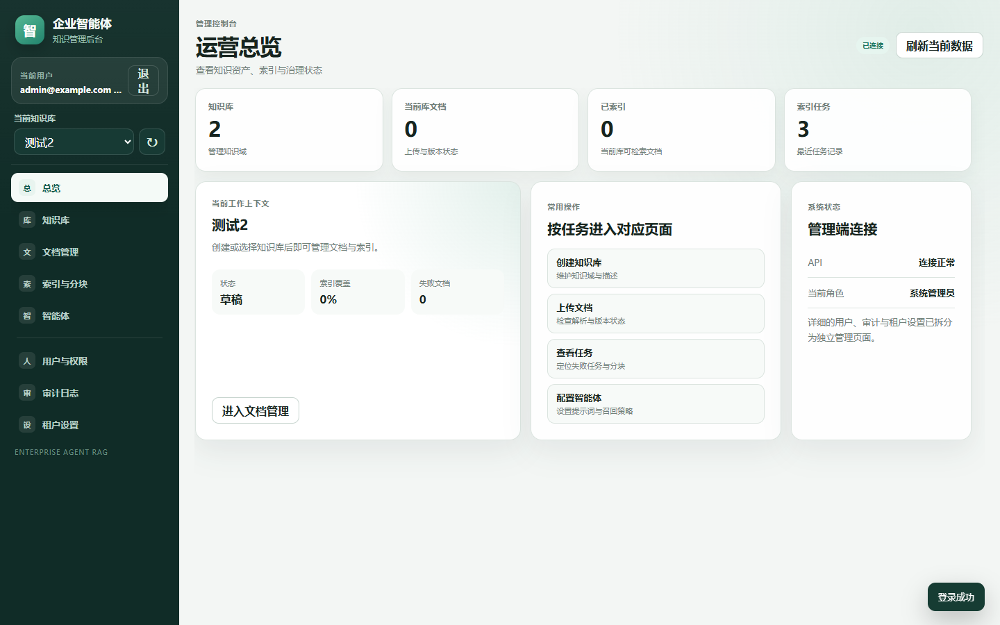
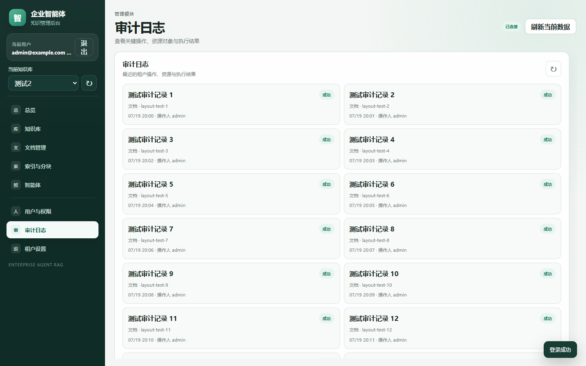
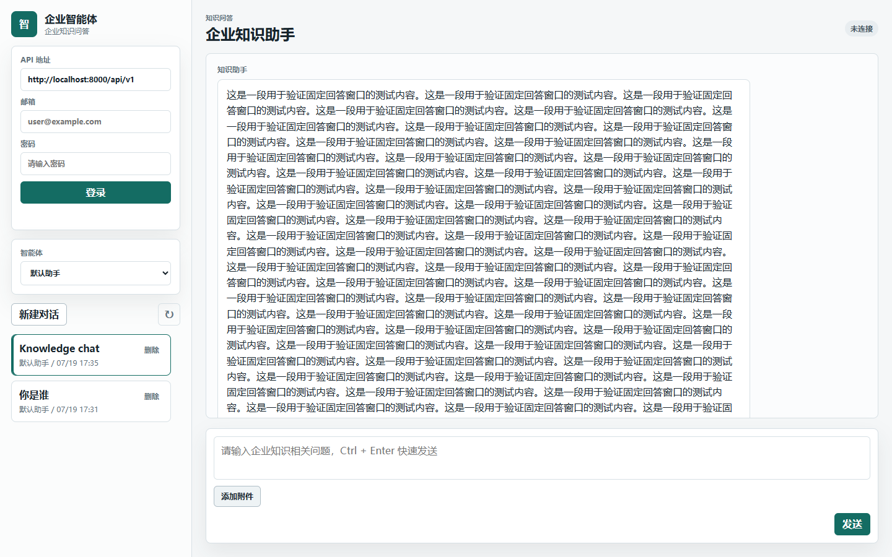

# Enterprise Agent RAG

An enterprise knowledge-base AI Agent project with an admin console, user chat console, Python/FastAPI backend, PostgreSQL + pgvector, Redis, MinIO, Celery async workers, and Alibaba Bailian/DashScope model integration.

## Scope

- Admin console: knowledge base CRUD, document upload, document versions, indexing jobs, and chunk inspection.
- User console: chat sessions, text questions, image/file attachment questions, and citation display.
- RAG backend: tenant-aware and knowledge-base-aware vector retrieval, followed by Bailian Chat answer generation with citations.
- Enterprise hardening: JWT, tenant isolation, object storage, async indexing, structured logs, rate limits, security headers, upload scanning, and Docker Compose deployment.

## 中文介绍

Enterprise Agent RAG 是一个面向企业知识库场景的 AI Agent 项目。项目提供管理控制台与用户对话端，后端基于 Python/FastAPI，使用 PostgreSQL + pgvector、Redis、MinIO 与 Celery，并接入阿里云百炼/DashScope 模型服务。

### 功能范围

- 管理端：知识库增删改查、文档上传与版本管理、索引任务管理以及文本分块查看。
- 用户端：多轮对话、文本提问、图片或文件附件提问以及答案引用来源展示。
- RAG 后端：按租户和知识库隔离的向量检索，并由百炼对话模型生成带引用的回答。
- 企业级能力：JWT 认证、租户隔离、对象存储、异步索引、结构化日志、限流、安全响应头、上传扫描以及 Docker Compose 部署。
- 模块化架构：后端采用“应用端口 + 基础设施适配器 + 组合根”的依赖方向，业务用例不直接依赖模型、存储和任务队列厂商 SDK，便于替换实现与自动化测试。

## Interface Preview

### Admin Console

| Operations overview | Audit log |
| --- | --- |
|  |  |

### User Knowledge Assistant



## Documents

- [Product requirements](docs/01_product_requirements.md)
- [System architecture](docs/02_system_architecture.md)
- [Three-level memory and RAG design](docs/03_memory_and_rag_design.md)
- [Data model draft](docs/04_data_model.md)
- [API draft](docs/05_api_draft.md)
- [Development plan](docs/06_development_plan.md)
- [Batch 8 acceptance and demo loop](docs/13_batch8_acceptance_and_demo.md)
- [Batch 9 permissions, audit, and tenant settings](docs/14_batch9_permissions_audit_tenant_settings.md)
- [Batch 10 agent configuration and runtime policy](docs/15_batch10_agent_configuration.md)
- [Project file explanation](docs/16_project_file_explanation.md)
- [Modular architecture and extension rules](docs/17_modular_architecture.md)
- [Agentic RAG implementation](docs/18_agentic_rag_implementation.md)

## Docker Startup

```powershell
Copy-Item .env.example .env
docker compose up --build -d
```

```powershell
docker compose exec api alembic upgrade head
```

```powershell
docker compose exec api python -m app.cli create-admin --email admin@example.com --password "ChangeMe123!" --tenant-name "Demo Enterprise" --if-not-exists
```

Open:

- API Docs: http://localhost:8000/docs
- Admin: http://localhost:5173
- User: http://localhost:5174
- Health: http://localhost:8000/api/v1/health
- Readiness: http://localhost:8000/api/v1/ready
- MinIO Console: http://localhost:9001

## One-command Local Deployment

> [!WARNING]
> The bundled credentials and published ports are for local development only. Before any shared or internet-facing deployment, replace the PostgreSQL, MinIO, JWT, and administrator credentials; restrict database, Redis, and object-storage ports; keep `.env` untracked; and terminate TLS at a trusted reverse proxy.

```powershell
.\scripts\deploy-local.ps1 -AdminEmail admin@example.com -AdminPassword "ChangeMe123!" -TenantName "Demo Enterprise"
```

Basic smoke test. This does not require a real Bailian/DashScope API key:

```powershell
.\scripts\smoke-docker.ps1 -CreateAdmin
```

Full RAG acceptance. Set `DASHSCOPE_API_KEY` in `.env` first:

```powershell
.\scripts\smoke-docker.ps1 -CreateAdmin -RunModelChecks
```

## Bailian Model Settings

```env
DASHSCOPE_API_KEY=your-api-key
BAILIAN_BASE_URL=https://dashscope.aliyuncs.com/compatible-mode/v1
BAILIAN_CHAT_MODEL=qwen-plus
BAILIAN_VISION_MODEL=qwen-vl-plus
BAILIAN_EMBEDDING_MODEL=text-embedding-v4
BAILIAN_EMBEDDING_DIMENSIONS=1024
```

## Useful Commands

```powershell
docker compose ps
docker compose logs -f api
docker compose logs -f worker
.\scripts\healthcheck.ps1
```

## Technology Baseline

- Backend: Python, FastAPI, SQLAlchemy, Celery
- Database: PostgreSQL + pgvector
- Object storage: MinIO or S3-compatible storage
- Cache and queue: Redis
- Document parsing: pypdf, python-docx, LibreOffice, Markdown parser
- AI provider: Alibaba Cloud Model Studio/Bailian, OpenAI-compatible API

## Security

Please report vulnerabilities privately by following [SECURITY.md](SECURITY.md). Do not include credentials or sensitive data in public issues.

## License

Licensed under the [MIT License](LICENSE).
