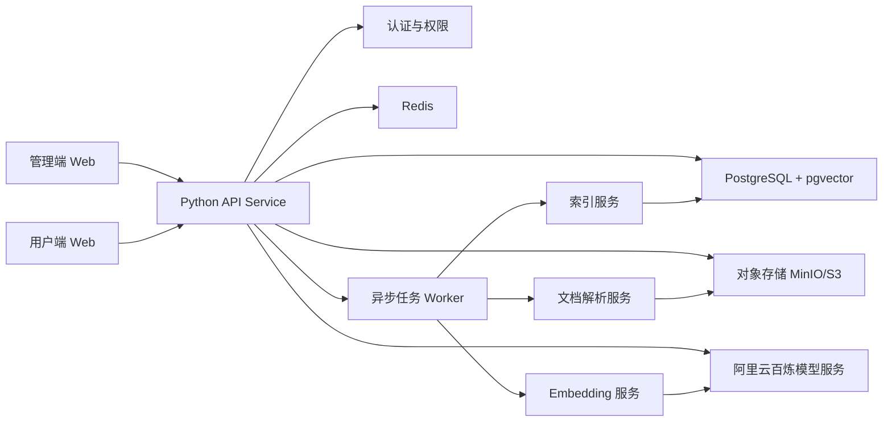

# 系统架构设计

## 1. 总体架构



## 2. 后端模块

### 2.1 API Service

建议使用 FastAPI。

职责：

- 提供管理端和用户端 REST API。
- 处理认证、权限、租户隔离。
- 创建文档处理任务。
- 执行用户问答流程中的查询改写、检索、Prompt 构造、模型调用。
- 提供流式回答接口。

### 2.2 Worker Service

建议使用 Celery 或 RQ，Redis 作为队列。

职责：

- 文档解析。
- 文档切片。
- Embedding 调用。
- 向量索引构建。
- 企业语义记忆更新。
- 失败重试。

### 2.3 Storage

对象存储保存：

- 原始文档。
- 解析后的中间文件。
- 用户临时上传文件。
- 图片附件。

数据库保存：

- 企业、用户、权限。
- 知识库、文档、版本。
- 片段、向量、记忆层级。
- 会话、消息、引用、反馈。

## 3. AI Provider 设计

模型服务通过统一接口封装：

```python
class LLMProvider:
    async def chat(self, messages, *, model, stream=False, **kwargs):
        ...

    async def embed(self, texts, *, model, **kwargs):
        ...

    async def vision(self, messages, *, model, **kwargs):
        ...
```

首个实现为 BailianProvider。

阿里云百炼支持 OpenAI 兼容 Chat 接口，官方文档说明可以通过调整 API Key、BASE_URL 和模型名称迁移原 OpenAI SDK 调用。生产环境建议通过环境变量配置：

- `DASHSCOPE_API_KEY`
- `BAILIAN_BASE_URL`
- `BAILIAN_CHAT_MODEL`
- `BAILIAN_EMBEDDING_MODEL`
- `BAILIAN_VISION_MODEL`

参考官方文档：[OpenAI Chat 接口兼容](https://help.aliyun.com/zh/model-studio/compatibility-of-openai-with-dashscope)。

## 4. 推荐技术栈

### 4.1 后端

- Python 3.11+
- FastAPI
- Pydantic v2
- SQLAlchemy 2.x
- Alembic
- PostgreSQL + pgvector
- Redis
- Celery or RQ
- OpenAI Python SDK for Bailian compatible mode

### 4.2 文档解析

- PDF: PyMuPDF、pdfplumber
- DOCX: python-docx
- DOC: LibreOffice headless 转换为 docx 或 pdf 后解析
- Markdown: markdown-it-py 或 mistune
- OCR: 后续可接入 PaddleOCR 或百炼视觉模型

### 4.3 前端

前端可以在后续批次选择：

- React + Vite
- Vue + Vite
- Next.js

管理端更适合中后台风格，用户端更适合简洁对话界面。

## 5. 部署形态

MVP 可使用单机 Docker Compose：

- `api`
- `worker`
- `postgres`
- `redis`
- `minio`
- `frontend-admin`
- `frontend-user`

生产环境可拆分为 Kubernetes 或云服务部署。

## 6. 权限边界

所有查询都必须带上：

- `tenant_id`
- `user_id`
- `role`
- `knowledge_base_ids`

向量检索不能只按相似度召回，必须在 SQL 或向量库过滤条件中加入租户和知识库权限。

