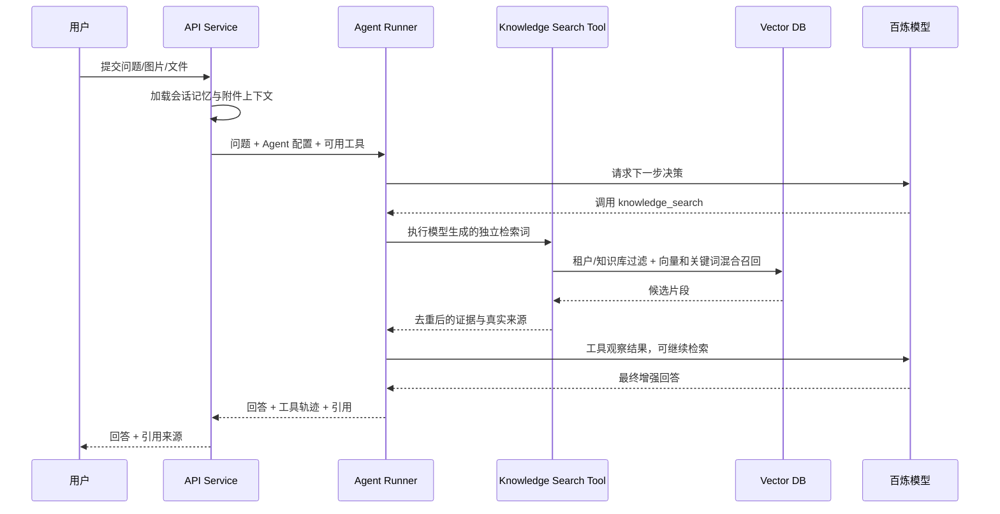

# 三级记忆与 RAG 设计

## 1. 三级记忆定义

本项目将企业知识库设计为三级记忆，既保留原始材料，又支持高质量语义检索和 Agent 推理。

### 1.1 一级记忆：原始文档记忆

一级记忆保存企业上传的原始知识资产。

内容：

- 原始文件
- 文档版本
- 文件类型、大小、Hash
- 上传人、上传时间
- 所属企业、知识库、目录
- 文档权限
- 解析状态

价值：

- 保留可审计源文件。
- 支持重新解析和重新索引。
- 支持引用回溯。

### 1.2 二级记忆：知识片段记忆

二级记忆是 RAG 检索的主要对象。

内容：

- 文档解析后的段落、标题、表格文本、页码。
- 基于语义切分后的 chunk。
- chunk embedding 向量。
- chunk 元数据，包括章节、页码、标题路径、来源文档。
- chunk 权限继承。

价值：

- 支持向量检索。
- 支持关键词和混合检索。
- 支持回答引用。

### 1.3 三级记忆：企业语义记忆

三级记忆是从多个知识片段中抽取出的高阶知识，用来提升 Agent 对企业语境的理解。

内容：

- 文档摘要。
- 知识库摘要。
- 常见问答。
- 术语表。
- 产品、流程、制度等结构化条目。
- 用户高频问题和已验证答案。

价值：

- 提升复杂问题回答质量。
- 降低只靠片段召回导致的上下文割裂。
- 支持 Agent 形成企业专属语义背景。

## 2. Agentic RAG 问答流程



## 3. 检索策略

当前实现使用混合检索：

- 将用户问题转为 embedding。
- 在 `knowledge_chunks` 表中按租户和知识库过滤。
- 使用 pgvector 计算语义相似度。
- 同时按关键词、编号和中文短词召回。
- 加权融合两路结果并按 chunk 去重。
- Agent 可以改写查询并连续检索多次。

后续可继续加入：

- 使用 rerank 模型或 LLM 轻量打分。
- 标题、章节、标签和发布时间加权。
- 控制上下文 Token 长度。

## 4. Prompt 策略

系统提示词应固定 Agent 边界：

- 只基于企业知识和明确上下文回答。
- 不确定时说明缺少依据。
- 引用来源必须对应真实命中的片段。
- 遇到权限外内容不得回答。

回答模板：

```text
你是企业知识助手。请基于给定资料回答用户问题。
如果资料不足，请说明无法从当前知识库确认。
回答后列出引用来源。

资料：
{retrieved_context}

用户问题：
{question}
```

## 5. 图片和文件提问

### 5.1 图片提问

MVP 策略：

- 用户上传图片。
- 调用视觉模型提取图片描述或 OCR 文本。
- 将提取文本与用户问题组合后进入 RAG。
- 最终回答可同时参考图片内容和企业知识库。

### 5.2 文件提问

MVP 策略：

- 用户上传临时文件。
- 文件解析后仅作为当前会话上下文。
- 不写入企业知识库索引。
- 回答时同时使用临时文件上下文和企业知识库召回上下文。

## 6. 引用来源

每个回答保存引用信息：

- `document_id`
- `document_title`
- `chunk_id`
- `page_number`
- `heading_path`
- `score`
- `snippet`

前端展示时默认显示文档名和页码，展开后显示命中片段。

## 7. 质量评估

建议后续加入以下指标：

- 检索命中率
- 引用准确率
- 回答忠实度
- 用户满意度
- 无答案问题占比
- 低置信度问题占比
