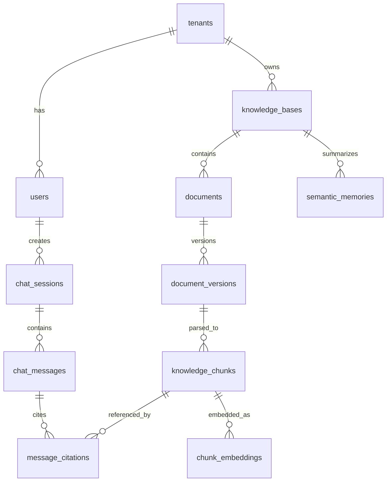

# 数据模型草案

## 1. 核心实体

## 2. 表设计

### 2.1 tenants

| 字段 | 类型 | 说明 |
| --- | --- | --- |
| id | uuid | 企业空间 ID |
| name | varchar | 企业名称 |
| status | varchar | active, disabled |
| created_at | timestamp | 创建时间 |
| updated_at | timestamp | 更新时间 |

### 2.2 users

| 字段 | 类型 | 说明 |
| --- | --- | --- |
| id | uuid | 用户 ID |
| tenant_id | uuid | 企业空间 ID |
| email | varchar | 邮箱 |
| name | varchar | 姓名 |
| password_hash | varchar | 密码哈希 |
| role | varchar | admin, user, auditor |
| status | varchar | active, disabled |
| created_at | timestamp | 创建时间 |

### 2.3 knowledge_bases

| 字段 | 类型 | 说明 |
| --- | --- | --- |
| id | uuid | 知识库 ID |
| tenant_id | uuid | 企业空间 ID |
| name | varchar | 知识库名称 |
| description | text | 描述 |
| status | varchar | draft, published, archived |
| visibility | varchar | private, tenant |
| created_by | uuid | 创建人 |
| created_at | timestamp | 创建时间 |
| updated_at | timestamp | 更新时间 |

### 2.4 documents

| 字段 | 类型 | 说明 |
| --- | --- | --- |
| id | uuid | 文档 ID |
| tenant_id | uuid | 企业空间 ID |
| knowledge_base_id | uuid | 知识库 ID |
| title | varchar | 文档标题 |
| file_type | varchar | docx, doc, pdf, md |
| status | varchar | uploaded, parsing, indexed, failed |
| current_version_id | uuid | 当前版本 |
| created_by | uuid | 上传人 |
| created_at | timestamp | 创建时间 |

### 2.5 document_versions

| 字段 | 类型 | 说明 |
| --- | --- | --- |
| id | uuid | 版本 ID |
| document_id | uuid | 文档 ID |
| version_no | integer | 版本号 |
| object_key | varchar | 对象存储地址 |
| file_hash | varchar | 文件 Hash |
| parse_status | varchar | pending, processing, success, failed |
| parse_error | text | 失败原因 |
| created_at | timestamp | 创建时间 |

### 2.6 knowledge_chunks

| 字段 | 类型 | 说明 |
| --- | --- | --- |
| id | uuid | 片段 ID |
| tenant_id | uuid | 企业空间 ID |
| knowledge_base_id | uuid | 知识库 ID |
| document_id | uuid | 文档 ID |
| document_version_id | uuid | 文档版本 ID |
| chunk_index | integer | 片段序号 |
| content | text | 片段正文 |
| heading_path | text | 标题路径 |
| page_number | integer | 页码 |
| token_count | integer | Token 数 |
| metadata | jsonb | 其他元数据 |
| created_at | timestamp | 创建时间 |

### 2.7 chunk_embeddings

| 字段 | 类型 | 说明 |
| --- | --- | --- |
| id | uuid | 向量 ID |
| chunk_id | uuid | 片段 ID |
| embedding_model | varchar | Embedding 模型 |
| embedding | vector | pgvector 向量 |
| created_at | timestamp | 创建时间 |

### 2.8 semantic_memories

| 字段 | 类型 | 说明 |
| --- | --- | --- |
| id | uuid | 语义记忆 ID |
| tenant_id | uuid | 企业空间 ID |
| knowledge_base_id | uuid | 知识库 ID |
| memory_type | varchar | summary, faq, term, procedure |
| title | varchar | 标题 |
| content | text | 内容 |
| source_chunk_ids | uuid[] | 来源片段 |
| confidence | numeric | 置信度 |
| status | varchar | draft, verified, deprecated |
| created_at | timestamp | 创建时间 |

### 2.9 chat_sessions

| 字段 | 类型 | 说明 |
| --- | --- | --- |
| id | uuid | 会话 ID |
| tenant_id | uuid | 企业空间 ID |
| user_id | uuid | 用户 ID |
| title | varchar | 会话标题 |
| created_at | timestamp | 创建时间 |
| updated_at | timestamp | 更新时间 |

### 2.10 chat_messages

| 字段 | 类型 | 说明 |
| --- | --- | --- |
| id | uuid | 消息 ID |
| session_id | uuid | 会话 ID |
| role | varchar | user, assistant, system |
| content | text | 文本内容 |
| input_type | varchar | text, image, file, mixed |
| metadata | jsonb | 模型、Token、耗时等 |
| created_at | timestamp | 创建时间 |

### 2.11 message_citations

| 字段 | 类型 | 说明 |
| --- | --- | --- |
| id | uuid | 引用 ID |
| message_id | uuid | 助手消息 ID |
| chunk_id | uuid | 知识片段 ID |
| score | numeric | 检索得分 |
| quote | text | 引用片段 |
| created_at | timestamp | 创建时间 |

## 3. 索引建议

- `knowledge_chunks(tenant_id, knowledge_base_id)`
- `knowledge_chunks(document_id, document_version_id)`
- `chunk_embeddings` 的 pgvector 向量索引
- `chat_messages(session_id, created_at)`
- `documents(tenant_id, knowledge_base_id, status)`

